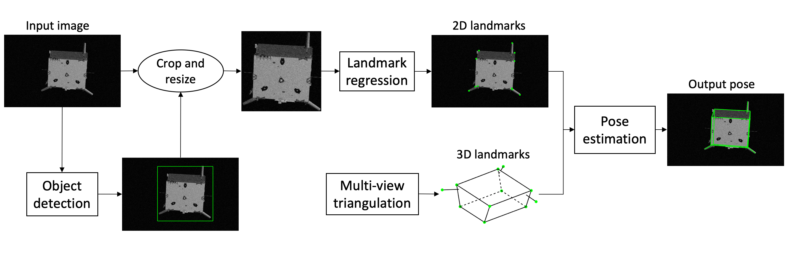

# [Satellite Pose Estimation with Deep Landmark Regression and Nonlinear Pose Refinement (ICCVW 2019)](https://arxiv.org/abs/1908.11542)

We propose the following pipeline for satellite pose estimation.


Our approach won the 1st place in the [Kelvin's Pose Estimation Challenge](https://kelvins.esa.int/satellite-pose-estimation-challenge/home/).

Tha relevant dataset can be downloaded from [https://kelvins.esa.int/satellite-pose-estimation-challenge/data/](https://kelvins.esa.int/satellite-pose-estimation-challenge/data/). 

Cite this work
````
@InProceedings{chen2019satellite,
  title={Satellite Pose Estimation with Deep Landmark Regression and Nonlinear Pose Refinement},
  author={Chen, Bo and Cao, Jiewei and Parra, Alvaro and Chin, Tat-Jun},
  booktitle={ICCVW},
  year={2019}
}
````
